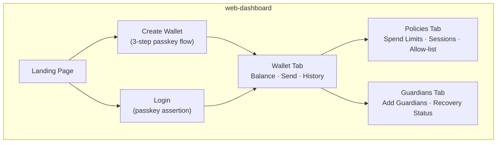
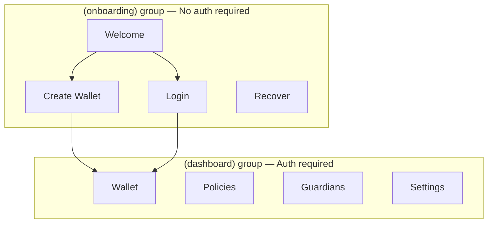
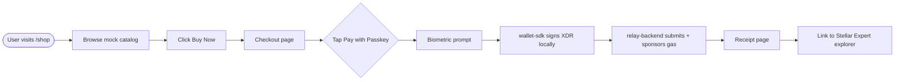
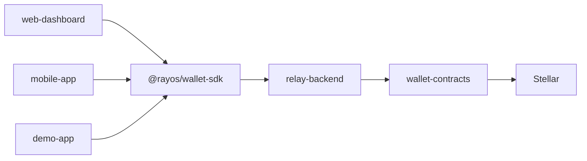

# Applications

> Three frontends, one SDK, same seamless experience.

Rayos ships three user-facing applications. All of them are powered by `@rayos/wallet-sdk` and connect to the same relay backend and smart contracts.

---

## Web Dashboard

**Repository:** [`web-dashboard`](https://github.com/Rayos-Org/web-dashboard)  
**Tech:** Next.js 16 · React 19 · shadcn/ui · Tailwind CSS v4 · TanStack Query

The primary user interface for Rayos. A full-featured wallet management app:



### How It's Structured

| Layer | What It Is | Rule |
|---|---|---|
| `app/` | Next.js App Router pages | Pages are thin — they just render components |
| `components/` | UI components | Grouped by domain: `wallet/`, `policies/`, `guardians/` |
| `hooks/` | React Query data hooks | All data fetching lives here, never in components |
| `lib/` | SDK client, auth, proxy | All backend calls go through `/api/` proxy |
| `app/api/` | Next.js Route Handlers | Thin proxy layer to relay-backend (prevents CORS) |

**Key Rule:** Components never call the backend directly. They call hooks. Hooks call the SDK or `lib/proxy.ts`. The browser never knows the relay URL.

### Sessions — How Login Works

After WebAuthn assertion succeeds:
1. A short-lived **JWT (2 hours)** is stored in an `httpOnly` cookie
2. Subsequent page loads read the cookie — no passkey prompt on every navigation
3. Expiry redirects to `/login` automatically

---

## Mobile App

**Repository:** [`mobile-app`](https://github.com/Rayos-Org/mobile-app)  
**Tech:** React Native 0.86 · Expo SDK 57 · expo-router · react-native-passkeys

The native sibling of the web dashboard — same features, but on iOS and Android with **truly native biometrics**.



### What Makes Mobile Different?

The mobile app uses the same `wallet-sdk` as the web app. The *only* platform-specific code is in `native/passkey-adapter.ts`:

```typescript
// native/passkey-adapter.ts — the ONLY platform seam
export const walletSdk = new WalletSdk({
  ...config,
  storage: secureStorageAdapter,      // expo-secure-store
  passkeyProvider: {                  // react-native-passkeys
    createCredential,
    signTransaction,
  },
});
```

Everything else — hooks, screens, business logic — is identical to what runs on web.

### Native-Specific Setup

For passkeys to work on real devices, the relay backend must serve domain association files:

| Platform | File | What It Does |
|---|---|---|
| iOS | `/.well-known/apple-app-site-association` | Links the app to a domain for Universal Links |
| Android | `/.well-known/assetlinks.json` | Verifies the app fingerprint for App Links |

Without these, passkeys silently fail on real hardware (they work in simulators/emulators without them).

### Deep Linking

Guardian recovery emails contain links like `rayos://recovery/<proposalId>`. When a guardian taps the link:
1. The OS opens the app to `app/recovery/[proposalId].tsx`
2. The screen prompts biometric login (even if not signed in)
3. Guardian sees the proposal and approves with one tap

---

## Demo App

**Repository:** [`demo-app`](https://github.com/Rayos-Org/demo-app)  
**Tech:** Next.js 16 · Tailwind CSS v4 · Framer Motion · Playwright E2E

A polished, single-vertical showcase application built entirely on `@rayos/wallet-sdk`. It demonstrates a **gasless, passkey-signed merchant checkout** on Stellar Testnet.

> This is what gets shown in grant application videos, live demos, and SCF reviewer calls.



### Design Priorities

| Priority | What It Means in Practice |
|---|---|
| **Reliability** | This app is recorded live. Every flow must work first try, every time. |
| **On-chain proof** | Every receipt links to Stellar Expert — makes "non-custodial" verifiable, not just claimed. |
| **Testnet labeling** | A persistent amber banner is required. SCF reviewers specifically check that demos can't be mistaken for live money apps. |
| **Env-var driven** | All backend URLs are env vars — no hard-coded production URLs in source. |

### Live Demo

🌐 **[rayos-demo-app.vercel.app](https://rayos-demo-app.vercel.app/)**

---

## How All Three Apps Connect



All three apps are just different **views** on the same underlying platform. They share:
- The same SDK package
- The same relay backend
- The same smart contracts
- The same design philosophy (no mock data in production paths)
