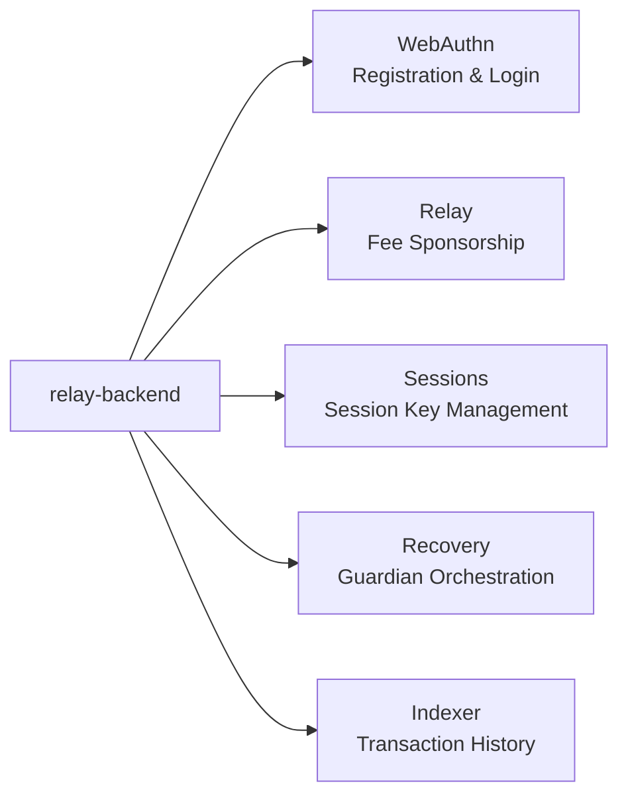
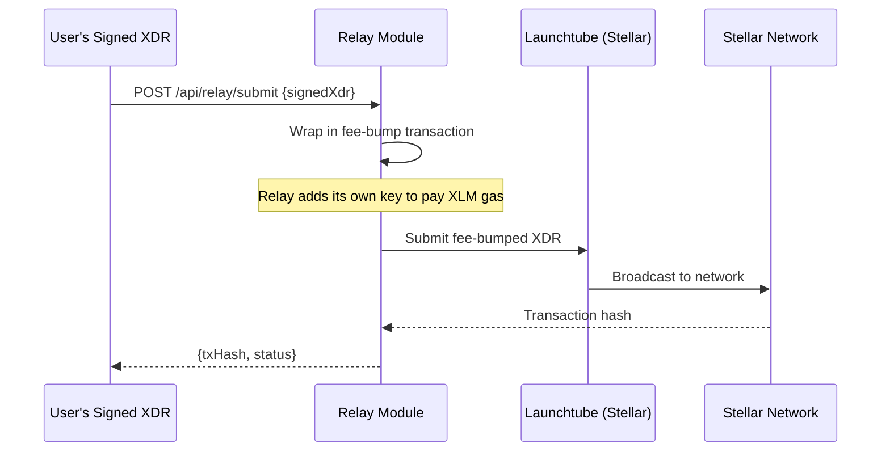

# Relay Backend

> The trustless middleman — it pays your gas, but it can't steal your funds.

**Repository:** [`relay-backend`](https://github.com/Rayos-Org/relay-backend)  
**Tech:** NestJS · PostgreSQL (Neon) · Redis (Upstash) · Drizzle ORM

---

## What Does the Relay Do?

The relay backend is a **NestJS API** deployed on Render. It has five distinct responsibilities:



---

## Module Breakdown

### WebAuthn Module

Handles passkey registration and login.

```
POST /api/webauthn/register/options   — Generate registration challenge
POST /api/webauthn/register/verify    — Verify attestation, store credential
POST /api/webauthn/assert/options     — Generate authentication challenge  
POST /api/webauthn/assert/verify      — Verify assertion, return session
```

**How challenges work:**
1. App requests a challenge from the relay
2. Relay generates a random one-time challenge, stores it in **Redis with a 5-minute TTL**
3. App uses the challenge to trigger the browser/device biometric
4. App returns the signed response to the relay
5. Relay verifies the signature and marks the challenge as used

Challenges cannot be reused — Redis automatically expires them.

### Relay Module

This is the "gasless" magic. When a user submits a signed transaction:



The relay **cannot change the inner transaction** — any modification would invalidate the user's passkey signature and get rejected by the blockchain.

### Sessions Module

Manages session keys for reduced-friction interactions:

```
GET    /api/sessions         — List active session keys for a wallet
POST   /api/sessions         — Create a new session key (requires passkey sig)
DELETE /api/sessions/:id     — Revoke a session key
```

### Recovery Module

Orchestrates the guardian recovery flow:

```
POST /api/recovery/propose              — Submit a recovery proposal
POST /api/recovery/approve              — Guardian approves a proposal
GET  /api/recovery/:proposalId          — Get proposal status
GET  /api/recovery/:proposalId/status   — Poll for completion
```

When approval threshold is met and timelock expires, the relay calls `execute_recovery` on the Policy contract. The contract validates everything on-chain independently.

### Indexer Module

Watches the Stellar network for events related to Rayos wallets and caches transaction history for fast retrieval by the frontend.

### Well-Known Module

Serves the domain association files required for passkeys to work on real devices:

```
/.well-known/apple-app-site-association   — iOS Universal Links
/.well-known/assetlinks.json              — Android App Links
```

Passkeys silently fail without these — they are not optional.

---

## Database Schema

The relay uses **PostgreSQL** (via Neon in production, Docker locally) with **Drizzle ORM**.

Key tables:
- `credentials` — Maps `credential_id` to `wallet_address`
- `recovery_proposals` — Full proposal state with guardian approvals
- `session_keys` — Session key metadata and scopes

**Redis** is used only for ephemeral data:
- WebAuthn challenges (5-minute TTL, auto-expire)
- Rate limiting

---

## Trust Model

The relay is designed to be **trustless**:

| What the Relay Holds | Security Implication |
|---|---|
| `credential_id` (public) | Same as publishing a public key — cannot sign anything |
| `wallet_address` | Public on-chain anyway |
| Session scopes & expiry | Off-chain cache only — on-chain contract is the authority |
| Recovery proposals | Orchestration only — smart contract validates final execution |
| ❌ Private keys | Never stored, never seen |
| ❌ Seed phrases | Not applicable |

> **Bottom line:** Even if someone hacked the relay server, they couldn't steal funds. They'd need to also compromise the user's secure hardware enclave.

---

## Running Locally

```bash
git clone https://github.com/Rayos-Org/relay-backend.git
cd relay-backend
pnpm install
cp .env.example .env

# Start PostgreSQL + Redis via Docker
docker-compose up -d

# Push database schema
pnpm db:push

# Start in dev mode
pnpm start:dev
```

| URL | Description |
|---|---|
| `http://localhost:3000/api` | REST API root |
| `http://localhost:3000/api/docs` | Interactive Swagger UI |
| `http://localhost:4983` | Drizzle Studio (visual DB browser) |

---

## Further Reading

- [`relay-backend` repository](https://github.com/Rayos-Org/relay-backend)
- [Security & Trust Model](../security/threat-model)
