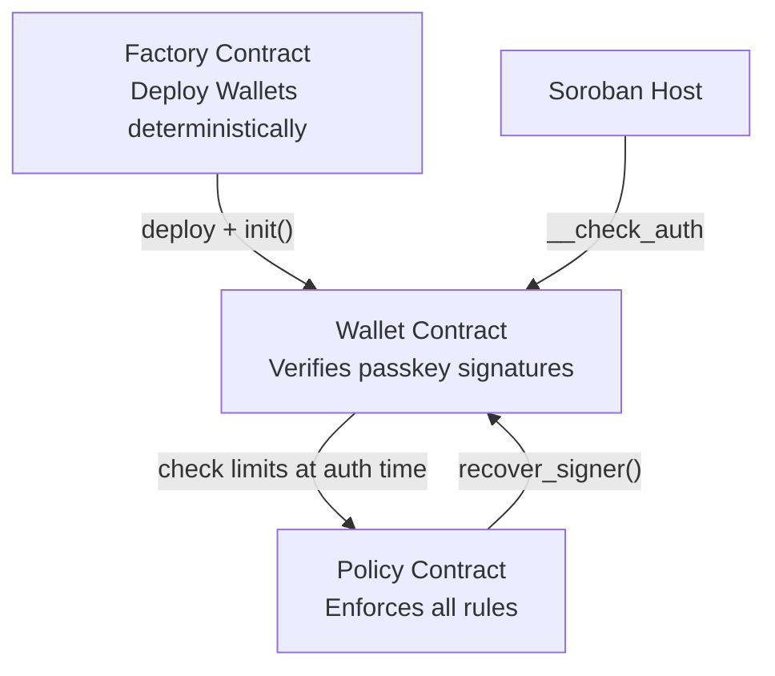
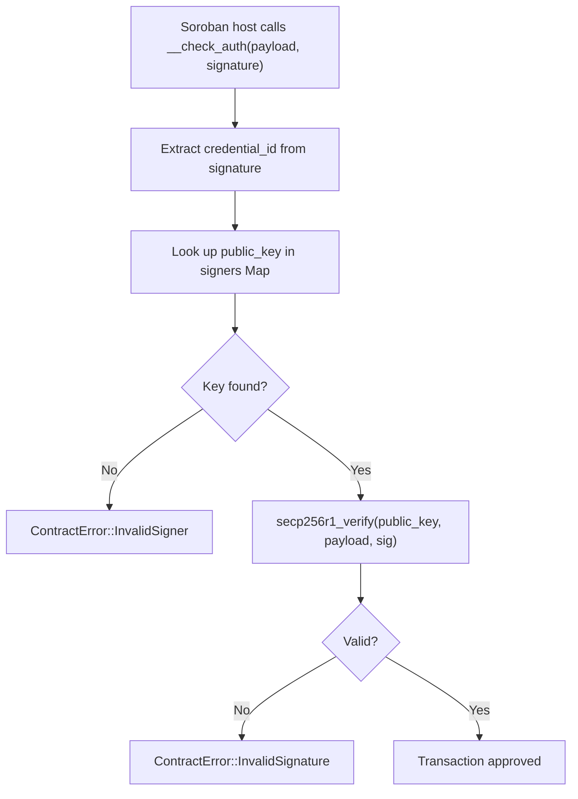
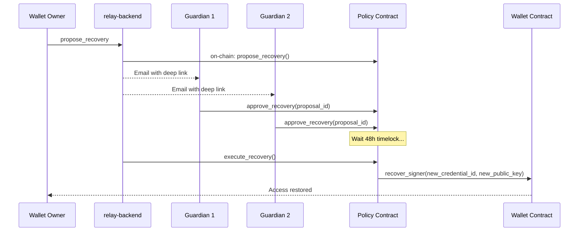

# Smart Contracts

> The on-chain heart of Rayos — three Rust contracts running on Stellar Soroban.

**Repository:** [`wallet-contracts`](https://github.com/Rayos-Org/wallet-contracts)

---

## Why Three Contracts?

A single "do everything" contract would be a nightmare to upgrade and test. Rayos separates concerns cleanly:

```
Wallet   = Identity  (who is allowed to sign?)
Policy   = Rules     (what are they allowed to do?)
Factory  = Registry  (how are wallets created?)
```

Each contract has one job and does it well. This means:
- You can **upgrade the policy** (add new rules) without touching the wallet
- The wallet can **share a policy** with other wallets (team setups)
- The factory is a **one-time deployer** — no ongoing privileges

---

## Contract Map



---

## The Wallet Contract

This is the core account contract. When Stellar needs to validate a transaction, it calls `__check_auth` on the wallet.

### What happens inside `__check_auth`?



**Plain English:** The wallet holds a list of passkeys. When a transaction arrives, it checks: *"Is this signature from a passkey we know? Is the math correct?"* If yes — approved. If no — rejected.

### Key Design: Signers as a Map

All registered passkeys are stored in a single `Map<credential_id → public_key>` in instance storage. This means:
- O(1) lookup during auth — fast
- All entries share a single TTL bump — simple
- The full list is readable via `get_signers()` — transparent

---

## The Factory Contract

The Factory deploys new wallet contracts. It uses **deterministic addressing** — meaning you can predict a wallet's Stellar address *before* deploying it, using only the factory address and a random salt.

```
wallet_address = SHA-256(factory_contract_id + salt)
```

This is computed by the Soroban host — no randomness, no nonces, no registry needed.

---

## The Policy Contract

This is the rule engine. The wallet delegates all policy decisions to this contract. It's upgradeable independently — you can swap out the policy without touching the wallet.

### What does the Policy enforce?

| Feature | How It Works |
|---|---|
| **Spend Limits** | Rolling accumulator — tracks how much has been spent per token in a time window. Blocks transactions that exceed the cap. |
| **Session Keys** | Temporary authorized keys with defined scopes and expiry times. Reduces passkey prompts for routine actions. |
| **Allow Lists** | Whitelist of contract addresses the wallet is permitted to interact with. |
| **Guardian Recovery** | N-of-M voting system for wallet recovery. Guardians approve proposals; a timelock enforces a waiting period. |

### Guardian Recovery Flow



---

## Storage Layout

### Wallet — Instance Storage
| Key | Type | Description |
|---|---|---|
| `Signers` | `Map<Bytes, Bytes>` | All `credential_id → public_key` pairs |
| `PolicyAddress` | `Address` | The active policy contract |

### Policy — Persistent Storage
| Key | Type | Description |
|---|---|---|
| `SpendLimit(token)` | `SpendLimit` | Rolling cap state per token |
| `SessionKey(id)` | `SessionKey` | Session metadata + expiry |
| `AllowList(address)` | `bool` | Per-contract allow/deny flag |
| `Guardian(address)` | `bool` | Guardian membership |
| `RecoveryProposal(id)` | `RecoveryProposal` | Full proposal state |

> **TTL Management:** Soroban contracts expire if not used. Rayos bumps the TTL 30 days on every mutation so active wallets stay alive indefinitely.

---

## Security Invariants

These properties are enforced by the contract code — not by policy or convention:

| Invariant | How It's Enforced |
|---|---|
| You can't remove the last signer | `CannotRemoveLastSigner` guard |
| Only the policy can trigger recovery | `policy_address.require_auth()` |
| Only the wallet owner can change policy settings | `owner.require_auth()` in every setter |
| Factory cannot control wallets after init | No stored reference back to factory |
| Signed payloads can't be replayed | Host-provided `Hash<32>` type — only the host can produce it |
