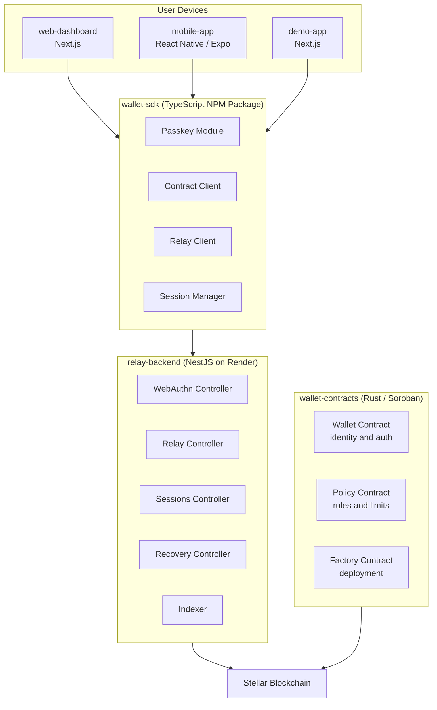
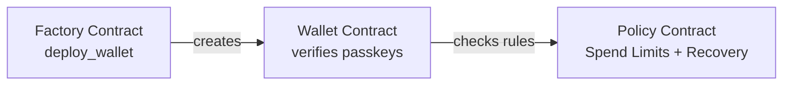
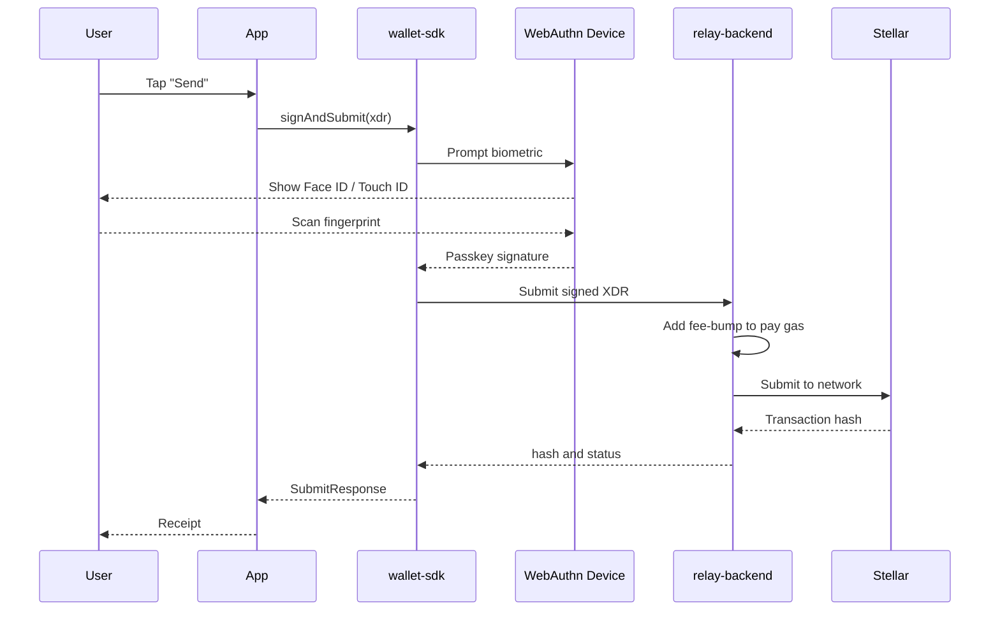
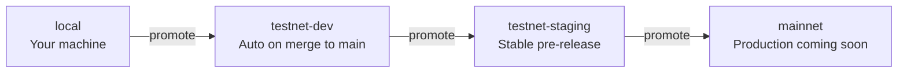

# Architecture Overview

> How all the pieces of Rayos fit together — explained from the ground up.

---

## The Big Picture

Rayos is not one app — it is a **platform** made of 7 working repositories. Each one does a specific job, like instruments in an orchestra. Alone they are useful. Together they make something remarkable.

Here is the full system at a glance:



---

## Layer by Layer

Think of Rayos as having **four layers**, like a building:

```
+----------------------------------------------+
|  Layer 4: User Interfaces                    |
|  web-dashboard · mobile-app · demo-app       |
+----------------------------------------------+
|  Layer 3: SDK                                |
|  @rayos/wallet-sdk                           |
+----------------------------------------------+
|  Layer 2: Backend                            |
|  relay-backend                               |
+----------------------------------------------+
|  Layer 1: Smart Contracts                    |
|  wallet-contracts (on Stellar Soroban)       |
+----------------------------------------------+
```

Each layer only talks to the layer immediately below it. The UI never directly touches the blockchain — it goes through the SDK, which goes through the relay, which talks to Soroban.

---

## Layer 1 — Smart Contracts

**Repository:** [`wallet-contracts`](https://github.com/Rayos-Org/wallet-contracts)

This is the foundation. Three smart contracts written in **Rust**, running on **Stellar Soroban**.



| Contract | Job | Analogy |
|---|---|---|
| **Factory** | Deploys new wallet contracts | The bank that opens new accounts |
| **Wallet** | Verifies passkey signatures, holds signers | The vault door |
| **Policy** | Enforces spend limits, sessions, guardians | The vault rule book |

> **Key Insight:** These contracts run on-chain. Rayos (the company, the relay, anyone) cannot override them. The rules are math.

---

## Layer 2 — Relay Backend

**Repository:** [`relay-backend`](https://github.com/Rayos-Org/relay-backend)

A **NestJS** API that acts as a helpful middleman. It has 5 jobs:

1. **WebAuthn** — Generate challenges for registration/login, verify passkey responses
2. **Relay** — Wrap user transactions in a fee-bump (pays XLM gas so users don't have to)
3. **Sessions** — Manage session keys for repeated low-risk operations
4. **Recovery** — Orchestrate multi-step guardian recovery
5. **Indexer** — Watch the chain for events (transaction history)

> **Trustless by design:** The relay can pay your gas fee, but it cannot move your funds. If it tried to tamper with your signed transaction, the blockchain would reject it immediately.

---

## Layer 3 — Wallet SDK

**Repository:** [`wallet-sdk`](https://github.com/Rayos-Org/wallet-sdk)

A TypeScript npm package (`@rayos/wallet-sdk`) that every frontend app installs. It wraps all the complexity of passkeys, XDR signing, and relay calls into simple function calls:

```typescript
// Create a new wallet
const { address } = await walletSdk.createWallet(options);

// Sign and submit a transaction
const receipt = await walletSdk.signAndSubmit(xdr, opts);
```

Apps never touch WebAuthn or Soroban directly. The SDK is the single abstraction layer.

---

## Layer 4 — User Interfaces

Three apps, all powered by the SDK:

| App | Repo | Description |
|---|---|---|
| **Web Dashboard** | [`web-dashboard`](https://github.com/Rayos-Org/web-dashboard) | Full wallet management — balance, send, policies, guardians |
| **Mobile App** | [`mobile-app`](https://github.com/Rayos-Org/mobile-app) | iOS + Android native experience with device biometrics |
| **Demo App** | [`demo-app`](https://github.com/Rayos-Org/demo-app) | A merchant checkout demo — gasless payments in USDC |

---

## How a Transaction Flows

Here is what happens when you tap "Send" — from your finger to the blockchain:



---

## The Infra Layer

**Repository:** [`infra`](https://github.com/Rayos-Org/infra)

This repo contains no running code — it is pure **configuration and tooling**:

- Shared GitHub Actions workflows (used by every repo)
- Environment variable templates
- Docker Compose for local development
- Deployment configs for Render and Vercel

Every other repo pulls its CI/CD from `infra` — change a workflow once, update everywhere.

---

## Environments

Rayos uses a four-tier environment model:



| Environment | Network | Purpose |
|---|---|---|
| `local` | Stellar Testnet | Your own machine |
| `testnet-dev` | Stellar Testnet | Shared staging, auto-deployed |
| `testnet-staging` | Stellar Testnet | Stable, mirrors mainnet config |
| `mainnet` | Stellar Mainnet | Production (pending audit) |

> No repo can skip directly to mainnet. The pipeline enforces the promotion order.

---

## Further Reading

- [Smart Contracts Deep Dive](./contracts)
- [SDK Architecture](./sdk)
- [Relay Backend Architecture](./backend)
- [Apps Architecture](./apps)
