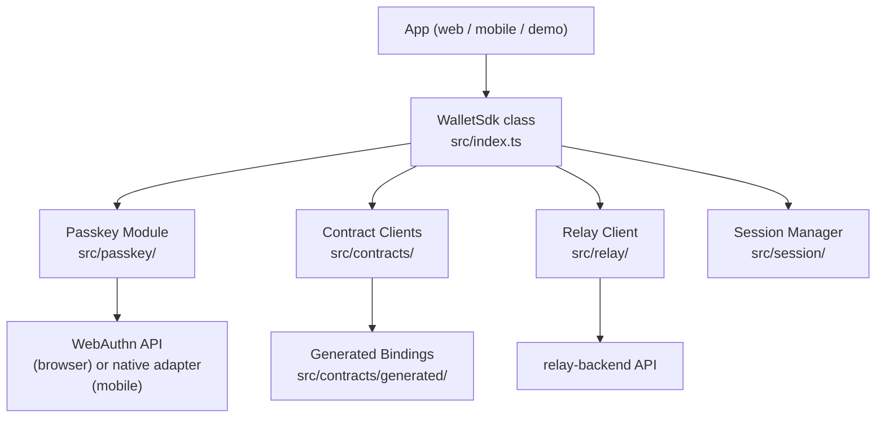
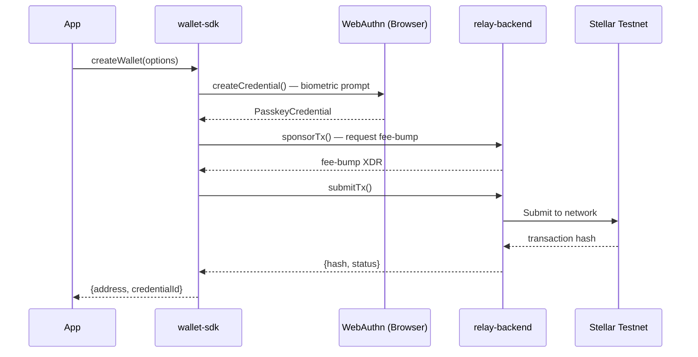
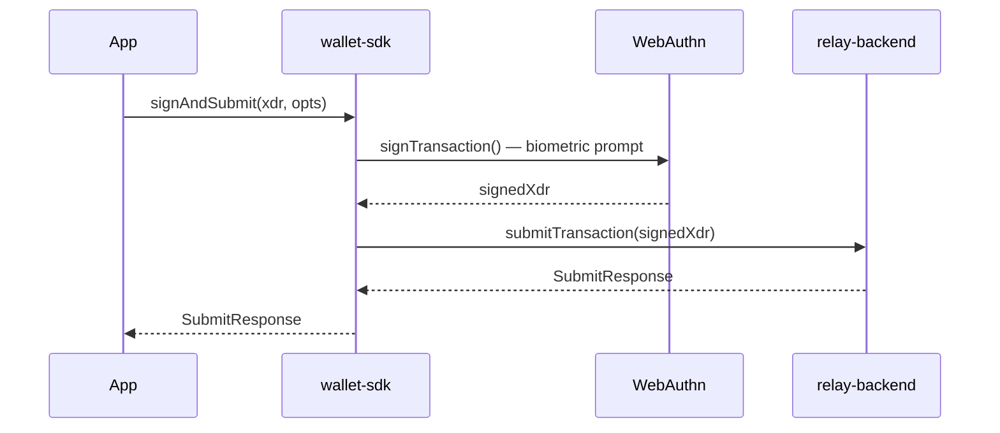

# Wallet SDK

> The TypeScript library that makes Rayos usable from any frontend app.

**Repository:** [`wallet-sdk`](https://github.com/Rayos-Org/wallet-sdk)  
**Package:** `@rayos/wallet-sdk`

---

## What Is It?

The `wallet-sdk` is a TypeScript npm package. Every frontend app (web dashboard, mobile app, demo app) installs it as a dependency. It is the **single abstraction layer** between apps and the underlying passkeys + smart contracts.

Without the SDK, a developer would need to:
- Understand WebAuthn API calls
- Build and sign Soroban XDR transactions manually
- Talk to the relay backend directly
- Handle session key caching

With the SDK, it's just:
```typescript
const receipt = await walletSdk.signAndSubmit(xdr, opts);
```

---

## Module Structure



| Module | File(s) | What It Does |
|---|---|---|
| **Passkey** | `src/passkey/` | Register and sign with WebAuthn credentials |
| **Contract Clients** | `src/contracts/` | High-level wrappers for wallet + policy contracts |
| **Relay Client** | `src/relay/client.ts` | Submit and sponsor transactions via the relay |
| **Session Manager** | `src/session/` | Create, cache, expire, and revoke session keys |

---

## Key Flows

### Wallet Creation



### Sign & Submit



---

## The PasskeyProvider Interface

This is the SDK's secret superpower for cross-platform compatibility.

The SDK defines:
```typescript
interface PasskeyProvider {
  createCredential(options: PasskeyRegistrationOptions): Promise<PasskeyCredential>;
  signTransaction(xdr: string, options: PasskeySignOptions): Promise<PasskeyAssertion>;
}
```

- **Web browsers** use `@simplewebauthn/browser` — the default, works out of the box
- **Mobile apps** inject `native/passkey-adapter.ts` — uses `react-native-passkeys` for native biometrics

Everything above this interface is **100% platform-agnostic**. The same hooks, screens, and business logic work on both web and mobile.

---

## Generated Bindings — Never Edit These!

The `src/contracts/generated/` folder contains auto-generated TypeScript type bindings for all three Soroban contracts. They are produced by:

```bash
bash scripts/regenerate-bindings.sh
# Runs: stellar contract bindings typescript against deployed WASMs
```

> **Rule:** Never hand-edit files in `src/contracts/generated/`. They are regenerated when contracts change. Any manual edits will be overwritten.

---

## Session Keys

Session keys reduce how often users are asked for their fingerprint. Here's the idea:

1. User signs once with their passkey to create a session key
2. The session key is stored locally (and registered on-chain via the policy contract)
3. For the next N hours, routine transactions use the session key — no biometric prompt needed
4. Session expires, or user revokes it manually

The SDK's `SessionManager` handles local caching. The policy contract handles on-chain enforcement. Losing the local cache is inconvenient (you'll be prompted sooner), but never a security risk.

---

## Error Hierarchy

```
Error
└── SdkError (code: string, contractCode?: number)
    ├── WalletError
    │   ├── UNAUTHORIZED
    │   └── INVALID_SIGNATURE
    └── PolicyError
        ├── SPEND_LIMIT_EXCEEDED
        └── INVALID_SESSION
```

All errors carry a typed `code` string so you can handle them predictably:
```typescript
try {
  await walletSdk.signAndSubmit(xdr, opts);
} catch (err) {
  if (err instanceof PolicyError && err.code === 'SPEND_LIMIT_EXCEEDED') {
    showToast('You have hit your spending limit for today.');
  }
}
```

---

## Further Reading

- [`wallet-sdk` repository](https://github.com/Rayos-Org/wallet-sdk)
- [Integrating the SDK guide](../guides/integrating-the-sdk)
