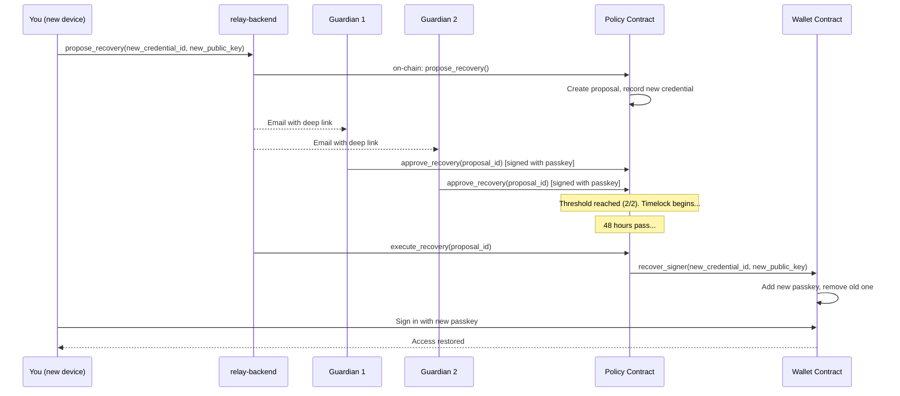

---
id: recovery-flow
title: Recovery Flow
sidebar_label: "🔄 Recovery Flow"
---

# Recovery Flow

> Lost your phone? Don't panic. Your guardians have your back.

One of Rayos's most important features is **guardian-based recovery** — a way to regain access to your wallet if you lose your device, without relying on any seed phrase or central authority.

---

## How It Works — The Simple Version

Before you lose access:
1. You **designate guardians** — trusted friends, family members, or other devices you control
2. You set a **threshold** — e.g., "2 out of 3 guardians must approve"
3. You set a **timelock** — e.g., "48 hours must pass before recovery executes"

After you lose access:
1. You (or someone helping you) **submit a recovery proposal** with your new device's passkey
2. Guardians receive an email with a **deep link** (or a notification in the app)
3. Each guardian **approves** by tapping the link and using their own passkey
4. Once enough guardians approve and the timelock passes, **your new passkey is added** to the wallet
5. You can sign in with your new device ✅

---

## Full Technical Flow

---

## Setting Up Recovery

### Step 1: Add Guardians

From the Guardians tab in the web dashboard or mobile app:
1. Click **"Add Guardian"**
2. Enter the guardian's email address
3. The guardian receives an invitation; they need a Rayos wallet to accept
4. Once accepted, the guardian address is registered on-chain in your Policy contract

### Step 2: Set Threshold and Timelock

| Setting | Recommended | Description |
|---|---|---|
| **Threshold** | 2-of-3 | Minimum guardians needed to approve |
| **Timelock** | 48 hours | Time to wait after threshold is reached |

The timelock gives you time to cancel a fraudulent recovery attempt if a guardian is compromised.

---

## Initiating Recovery

If you've lost your device:

1. On your new device, open the app and click **"Recover Wallet"**
2. The app generates a new passkey on your new device
3. Submit the recovery proposal — this is a public action, no old passkey needed
4. Notify your guardians (the relay emails them automatically)

---

## Guardian Approval

Guardians receive:
- An **email** with a deep link (e.g., `https://app.rayos.org/recovery/<proposalId>`)
- OR a **push notification** if they have the mobile app

Clicking the link:
1. Opens the app (or browser)
2. Shows the recovery proposal details
3. Guardian signs with **their own passkey** to approve

---

## What the Smart Contract Validates

The Policy contract checks:

- ✅ Caller is a registered guardian (`Guardian(caller)` exists)
- ✅ Proposal ID is valid and active
- ✅ Threshold number of unique guardians have approved
- ✅ Timelock period has elapsed

If any check fails, `execute_recovery` reverts. The relay **cannot bypass these checks** — they run on-chain.

---

## Canceling a Recovery

If you regain access to your original device, or if a recovery proposal is fraudulent:

1. Sign in with your original passkey
2. Go to the Guardians tab
3. Click **"Cancel Recovery"**

This executes `cancel_recovery` on the Policy contract. Only the wallet owner can cancel.

---

## Security Considerations

- **Choose guardians carefully** — they have the power to take over your wallet (with others' help)
- **Diversify guardians** — don't pick all guardians from the same device, service, or family
- **The timelock is your safety net** — if you see an unexpected recovery proposal, cancel it before the timelock expires
- **Test recovery before you need it** — the mobile app includes a recovery simulation mode on testnet
