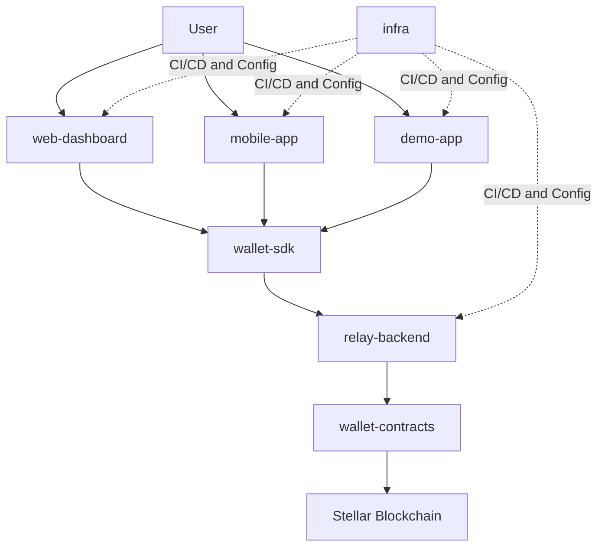

---
id: intro
title: Welcome to Rayos
sidebar_label: "\U0001F44B Introduction"
slug: /
---

# Welcome to Rayos ⚡

> **Seedless, passkey-native smart wallets — built on Stellar.**

---

## What Is Rayos?

Imagine paying for something online without typing a password, without writing down a secret phrase, and without needing any browser extension. You just tap your face or fingerprint — and it's done.

**That's Rayos.**

Rayos is an open-source platform that builds **smart wallets on the Stellar blockchain**. These wallets use your device's built-in biometrics (Face ID, Touch ID, fingerprint, or security key) instead of traditional seed phrases. No seed phrase to write down. No password to forget. No way for anyone else to steal it.

---

## The Problem We Solve

Traditional crypto wallets have a fatal flaw — the **seed phrase**.

```
❌ "Write these 24 words down and keep them safe forever."
```

Most people don't. And when they lose the phrase, they lose everything. Forever.

Rayos replaces the seed phrase with something you already use every day: **your face or fingerprint**. These biometrics never leave your device — they live in a secure chip called a "secure enclave" and cannot be extracted or copied.

---

## How It Works — The Simple Version

Think of Rayos like a bank vault with a very smart lock:

```
Your Fingerprint → Unlocks the Lock → Opens the Vault → Money Moves
```

But instead of a real bank:
- The **lock** is your passkey (stored in your phone's secure chip)
- The **vault** is a smart contract on the Stellar blockchain
- The **key** is mathematical — verified by the blockchain without anyone in the middle

---

## The Rayos Ecosystem

Rayos is made of **8 repositories** that work together as one coherent system:



| Repository | What It Is | Think of It As |
|---|---|---|
| [`wallet-contracts`](https://github.com/Rayos-Org/wallet-contracts) | Smart contracts in Rust on Stellar Soroban | The actual vault on the blockchain |
| [`wallet-sdk`](https://github.com/Rayos-Org/wallet-sdk) | TypeScript library | The toolkit apps use to talk to the vault |
| [`relay-backend`](https://github.com/Rayos-Org/relay-backend) | NestJS backend API | The helpful middleman who pays gas fees |
| [`web-dashboard`](https://github.com/Rayos-Org/web-dashboard) | Next.js web app | The website where you manage your wallet |
| [`mobile-app`](https://github.com/Rayos-Org/mobile-app) | React Native / Expo app | The phone app (iOS and Android) |
| [`demo-app`](https://github.com/Rayos-Org/demo-app) | Demo checkout experience | The live proof-of-concept with real transactions |
| [`infra`](https://github.com/Rayos-Org/infra) | CI/CD and deployment config | The behind-the-scenes plumbing |
| [`docs`](https://github.com/Rayos-Org/docs) | This site | What you are reading right now |

---

## Key Features

### No Seed Phrases
Your wallet is secured by your device biometrics. The passkey never leaves your hardware.

### Gasless Transactions
The relay backend sponsors XLM transaction fees. Users never need to buy XLM just to use the wallet.

### On-Chain Rules (Policies)
You can set spending limits, time-locked sessions, and guardian-based recovery — all enforced by smart contracts, not by us.

### Social Recovery
Lost your phone? Your pre-chosen guardians can vote to restore your access. No company can override this; it's enforced by on-chain math.

### Open Source
Everything — from the Rust contracts to the React components — is open source under the Apache-2.0 license.

---

## Who Is This For?

- **Developers** who want to integrate a passkey wallet into their own app
- **Contributors** who want to understand how Rayos works and help build it
- **Grant reviewers** evaluating the project for the Stellar Community Fund (SCF)

---

## Ready to Dive In?

- **[Quickstart](./guides/quickstart)** — Get the full stack running in under 10 minutes
- **[Architecture Overview](./architecture/overview)** — Understand how everything fits together
- **[Integrating the SDK](./guides/integrating-the-sdk)** — Embed Rayos in your own app

---

> **All transactions on Rayos currently run on Stellar Testnet — no real funds are ever used in demos.**
