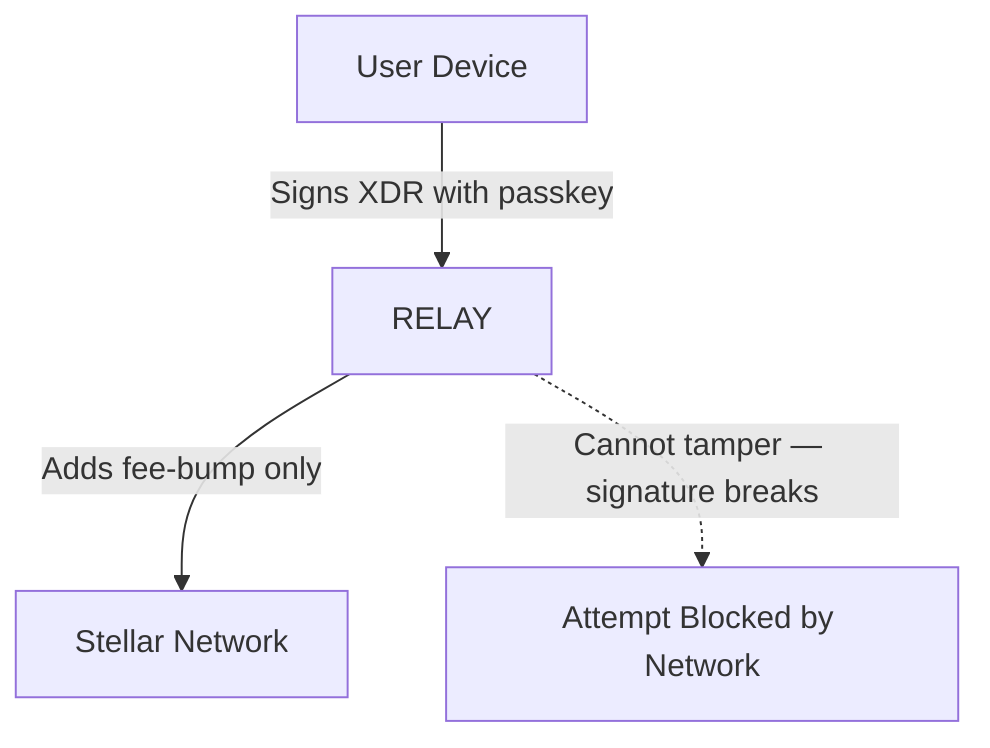
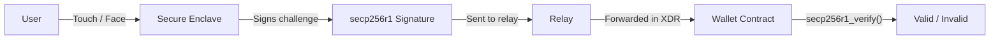

---
id: threat-model
title: Threat Model
sidebar_label: "🛡️ Threat Model"
---

# Threat Model

> What Rayos protects against, what it doesn't, and why.

---

## Core Security Guarantee

**Your funds are secured by your hardware. Not by Rayos.**

The passkey that controls your wallet is generated and stored in your device's **secure enclave** (Apple Keychain, Android Keystore, or a hardware security key). This chip:
- Cannot be read, even by the operating system
- Cannot be exported or copied
- Requires biometric or PIN verification for every use

Even if every Rayos server were hacked today, an attacker still couldn't move your funds without physical access to your device.

---

## What Rayos Protects Against

| Threat | Protection |
|---|---|
| **Phishing** | Passkeys are domain-bound — they only work on the site they were created for. A fake site gets nothing. |
| **Password breach** | There are no passwords. Can't breach what doesn't exist. |
| **Seed phrase loss** | There are no seed phrases. Your passkey is the key. |
| **Relay server compromise** | Relay can pay gas but cannot sign transactions or move funds. |
| **Man-in-the-middle** | Passkey assertion is cryptographically bound to the specific challenge from the server. Replaying it fails. |
| **Unauthorized recovery** | Recovery requires N-of-M guardian signatures + timelock. Compromising one guardian is not enough. |

---

## What Rayos Does NOT Protect Against

| Threat | Why Not | Mitigation |
|---|---|---|
| **Compromised device** | If someone has your unlocked phone, they have your passkey. | Enable a strong device PIN. Enable remote wipe. |
| **All guardians compromised** | If all your guardians are controlled by an attacker, recovery can be hijacked. | Choose guardians carefully. Diversify. |
| **Social engineering** | Guardians could be tricked into approving a fraudulent recovery. | Guardians should verify out-of-band before approving. |
| **Smart contract bugs** | A bug in the contracts could be exploited. | Independent audit is planned before mainnet. |
| **Stellar network issues** | If Stellar is down, transactions can't be processed. | This is infrastructure risk, not a Rayos flaw. |

---

## The Relay's Trust Boundary

The relay-backend is **not trusted with funds**:

**What the relay stores:**
- `credential_id` (public — equivalent to a username)
- `wallet_address` (public — on-chain anyway)
- WebAuthn challenges (ephemeral, 5-min TTL in Redis)
- Session key metadata (on-chain contract is the authority)
- Recovery proposals (on-chain contract validates execution)

**What the relay never stores:**
- Private keys
- Seed phrases
- Raw biometric data
- Unencrypted session secrets

---

## Passkey Security Model

- The private key **never leaves** the secure enclave
- The relay only sees the **signature** (public output)
- The Soroban contract verifies using the **public key** (stored on-chain at wallet creation)
- The `Hash<32>` type on the contract side ensures only the Stellar host can produce a valid payload — preventing replay attacks

---

## Guardian Recovery Security

Recovery has **two independent safeguards**:

1. **Threshold** — Multiple guardians must approve (typically 2-of-3)
2. **Timelock** — A waiting period (typically 48h) before execution

Even if an attacker compromises one guardian, they still need:
- Enough other guardians (to meet threshold)
- To wait out the timelock (during which the real owner can cancel)

---

## Reporting a Vulnerability

Please see [Responsible Disclosure](./responsible-disclosure) for how to report security issues.

> **Do not open a public GitHub issue for security vulnerabilities.**
